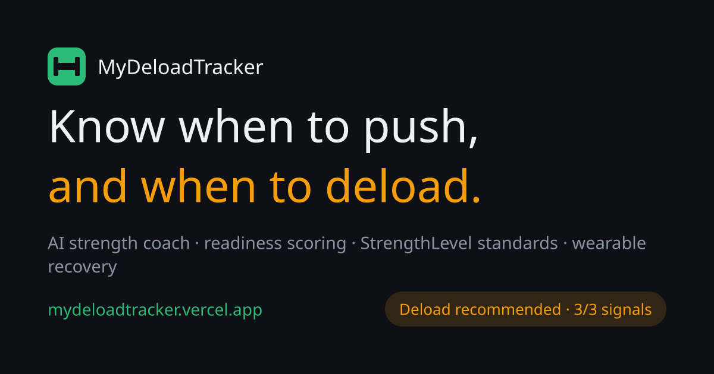
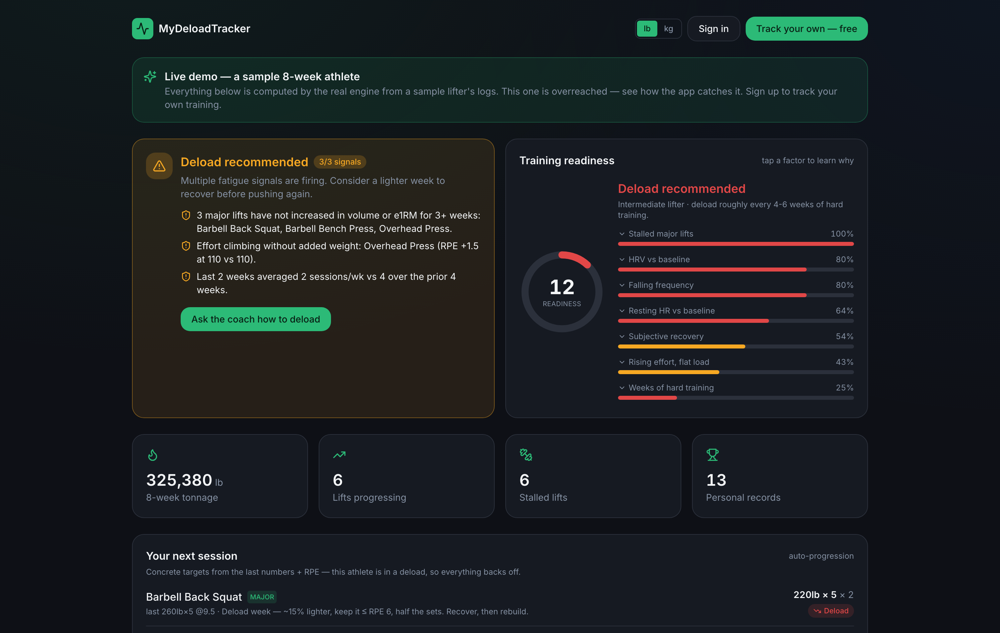

# MyDeloadTracker



An AI strength training coach that tells you when to deload.

**[Try the live app](https://mydeloadtracker.vercel.app)** &nbsp;·&nbsp; **[Open the no signup demo](https://mydeloadtracker.vercel.app/demo)**


## The problem

Most lifters don't stall because they got lazy. They stall because fatigue piles up faster than they recover, and nothing tells them. Apps like Strong and Hevy are great at recording what you did, but they never answer the one question that actually decides your next month: should I push, or should I back off?

MyDeloadTracker answers it. From the sets you'd log anyway, it figures out when you're overreaching and what to do about it.

## What it does

- **Deload detection.** A simple, readable model that flags a deload when two or more signals fire: a main lift's estimated 1RM hasn't moved in three weeks or more, effort (RPE) has crept up at the same weight, or your training frequency has dropped versus your recent baseline.
- **Readiness score, 0 to 100.** Nine fatigue factors rolled into one honest number, including estimated 1RM regression, HRV drops, resting heart rate, the acute to chronic workload ratio, and how many hard weeks you've stacked without a break. Tap any factor to see exactly why your score moved.
- **Strength standards.** Every main lift is ranked from Beginner to Elite based on what you lift relative to your bodyweight, by sex. Your overall level even sets your deload timing, since advanced lifters need to back off sooner than beginners.
- **Auto progression.** Concrete targets for your next session using double progression that reads your RPE and knows when you're in a deload.
- **Two ways to see volume.** Classic tonnage, plus hard sets per muscle per week measured against the 10 to 20 set range the research points to for growth. Tonnage flatters your heavy lifts, so sets are the fairer way to compare muscles.
- **An AI coach that actually knows your numbers.** A streaming chat built on Claude, with your last eight weeks of training and your readiness folded into its context and cached to keep it fast. It cites your real lifts, weeks, and trends instead of handing you generic advice.
- **Wearable sync.** Connect an Oura ring and it pulls your HRV, resting heart rate, and sleep on its own.
- **Everything else you'd expect.** Daily recovery logging (sleep, soreness, motivation, energy), PR celebrations, a rest timer, a searchable library of 200 plus exercises, kg or lb, and an installable app that respects the iPhone's Dynamic Island.

## What it looks like



The public demo runs on a sample athlete who is overreaching: a deload alert with the exact signals that fired, and a readiness score you can read factor by factor.

## Spotlight: the bar scanner

This is the one that makes people lean in.

Point your phone at a loaded barbell, either as a photo or a few seconds of live video. Claude's vision reads the plates, adds up the total weight, works out which lift it is, counts your reps, and logs the set for you.

Two things make it hold up in a real gym:

- **It uses context, not just the picture.** Your recent training history and the gym around you help it pick the right lift, and on video it reads the actual movement to tell a squat from a press from a deadlift.
- **The cost stays flat no matter how long your set runs.** A long set isn't a longer bill. Frames get sampled into a fixed, evenly spaced buffer that always covers the whole set, whether it lasted five seconds or sixty.

This is the phone version of where the whole thing is headed (see the vision below).

## How it works

The brain of the app is a pure analytics layer in `src/lib/analytics`. Every calculation runs as a plain function over one flat shape, `TrainingSet[]`, with nothing tangled into the UI.

- **Pure, testable functions.** Estimated 1RM (Epley), progression, deload, readiness, standards, and volume are each their own predictable module, all covered by 21 Vitest tests.
- **A readiness model you can see into.** The score comes from a noisy OR over weighted fatigue factors, run as a single scoring step. It's deterministic and explainable on purpose, so you always know why your number changed.
- **Server first.** Next.js 14 App Router with React Server Components keeps the client bundle small. Data lives in Supabase Postgres behind Row Level Security, so every athlete only ever sees their own training.
- **Reliable vision output.** The bar scanner calls Claude with a forced tool, so the model always hands back clean structured JSON the UI can use directly.

## The science, and the plan for ML

The readiness and deload logic is transparent now, and learnable later.

Right now it's a deterministic model grounded in current strength and recovery research, written up in `docs/DELOAD_SCIENCE.md`. There is no black box: tap a factor and you see the exact reason your score moved. The whole thing is built as one clean scoring step on purpose. Once enough real outcomes pile up, specifically whether performance rebounded after a suggested deload, that step can be swapped for, or blended with, a learned model without touching the rest of the app.

## Tech stack

- **Framework:** Next.js 14 (App Router)
- **Language:** TypeScript
- **Styling:** Tailwind CSS
- **Database and auth:** Supabase (Postgres and Auth, with Row Level Security)
- **AI and vision:** Anthropic Claude API
- **Charts:** Recharts
- **Product analytics:** PostHog
- **Hosting:** Vercel

## Where this is going: web, then wearables, then glasses

The web app and the coaching brain are the wedge, not the destination.

Meta recently opened its smart glasses to outside developers, with a toolkit that lets an app read the glasses' camera and audio and pipe it through its own AI. That is the whole game. The endgame is an AI strength coach that lives in your glasses: it sees your bar, logs your set hands free, counts your reps, and talks you through the work in your ear while you lift. A phone photo can read the weight but has to guess the lift. Glasses see the motion, so they just know. That is why the form factor matters, and the bar scanner is the proof that the hard part already works today.

## Running it locally

```bash
git clone https://github.com/melih-cin/mydeloadtracker.git
cd mydeloadtracker
npm install
```

Copy `.env.local.example` to `.env.local` and fill in your Supabase and Anthropic keys (Oura and PostHog are optional).

Set up the database by running the SQL files in `supabase/migrations` against your Supabase project, in order. You can paste them into the Supabase SQL editor or use the Supabase CLI.

Then start it:

```bash
npm run dev
```

Run the test suite with `npm test`.

## Status

Early, and built solo with a lot of AI assisted development. It is live with a public demo, and it is moving fast.

## Disclaimer

This is educational training analytics and automated heuristic feedback, not medical advice. Listen to your body, and talk to a professional about any pain or injury.

## License

Released under the MIT License. See [LICENSE](LICENSE).
